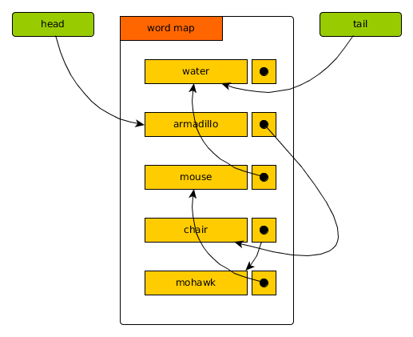
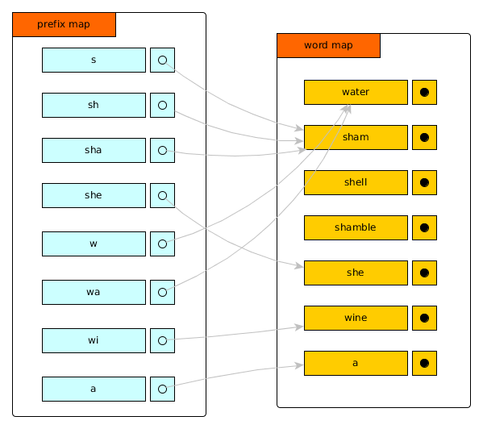

# SMAC - Small autocompletion engine in Go.

[](https://opensource.org/licenses/Apache-2.0)
[](http://godoc.org/github.com/pierods/smac)

SMAC is a tiny autocompletion engine written in Go. It supports UTF-8 alphabets. Emphasis is on speed and simplicity.

Performance on a 355k word dictionary on a modern computer is (see benchmark files):

* initialization time ~0.7 seconds
* average completion time 9000 ns (> 100k completions/sec)
* average memory occupation/dictionary size ratio varies between 13 and 16 (prefixMapDepth = 3 and 4 respectively)

SMAC is case-sensitive. If case-insensitivity is needed, clients should make sure to convert to either upper or lowercase before adding words and calling Complete().

Paging is not supported, since it is mostly responsibility of the client.

SMAC learns new words on the go, via the Learn() function, can UnLearn() them and can also UnLearn() words provided in the bootstrap dictionary, and keeps into account the frequency of acceptance of words (frequently used words) by giving them priority when generating completion lists.

If customizations of the autocompleter (learnt words etc.) are to survive re-instantiations, or they must be transferred somewhere else, SMAC can Save() what it has learnt to file and can subsequently Retrieve() them from file.

SMAC has not been tested on logographic alphabets, for which it would not make much sense, unless
an ortographic spelling is provided (hiragana to kanji for example). If there is such a need SMAC
could be adapted to it.

## Using SMAC

You would usually find a dictionary file and bootstrap SMAC from it:
```Go
ac, err := NewAutoCompleteLinoF(wordFile, 4, 10, 90)
	if err != nil {
		os.Exit(-1)
	}
```
The parameters to the constructor make sense for an average use (more detail below).

After getting an instance of SMAC, you can go straight to using it:
```Go
ac, _ := autoComplete.Complete("chair")
fmt.Println(ac)
```
To make SMAC smarter, make sure to Accept() every word that is selected after autocompletion:
```Go
err := autoComplete.Learn("chairman")
if err != nil {
  // do something
 }
```
Accept() will bounce an error if a word is not in the dictionary.

To make SMAC learn a new word, use Learn():
```Go
err := autoComplete.Learn("Pneumonoultramicroscopicsilicovolcanoconiosis")
if err != nil {
  // do something
 }
```
Learn() will bounce an error if the word to learn is already in the dictionary

To make SMAC forget a word, use UnLearn():
```Go
err := autoComplete.UnLearn("Pneumonoultramicroscopicsilicovolcanoconiosis")
if err != nil {
  // do something
 }
 ```
 UnLearn() will bounce an error if the word to forget was not learnt in the first place.

 To save to file whatever SMAC has learnt, use Save():
 ```Go
 err := autoComplete.Save("/home/....")
 if err != nil {
  // do something
 }
 ```
 Save() will only save a diff from a bootstrap dictionary. Save() will bounce an error if it cannot write to file.
 To retrieve a saved SMAC (possibly after using a bootstrap dictionary) use Retrieve():
  ```Go
 err := autoComplete.Retrieve("/home/....")
 if err != nil {
  // do something
 }
 ```
 Retrieve() will only retrieve a diff from a bootstrap dictionary. Retrieve() will bounce an error if it cannot read from file.
 ### Other constructors, finetuning
 You can also bootstrap from an array of strings:
```Go
ac, err := NewAutoCompleteLinoS([]string{"mary", "had", "a", "little", "lamb"}, 4, 10, 90)
	if err != nil {
		os.Exit(-1)
	}
```
 or just start from scratch and learn as you go:
```Go
ac, err := NewAutoCompleteLinoE(4, 10, 90)
	if err != nil {
		os.Exit(-1)
	}
```
 **Meaning of the constructor parameters**

 The first parameter is prefixMapDepth. It speeds up autocompletion, at the expense of memory usage. Practical values are 1, 2, 3 and 4.
 Speed and memory usage are (for a list of 355k words):

 prefixMapDepth|speed| memory usage
 --------------|-----|-------------
 1|630k ns/completion (1500 completions/sec)| 46 MB
 2|160k ns/completion (6000 completions/sec)| 50 MB
 3|30k ns/completion (32k completions/sec)| 51 MB
 4|9k ns/completion (60k completions/sec)| 60 MB

 The second parameter is the result size. It means how many words you get for an autocompletion. So for example, a result size of 5 would yield these results for "chair":

 chair
 chairborne
 chaired
 chairer
 chairing

while a result size of 10 would yield:

chair
chairborne
chaired
chairer
chairing
chairladies
chairlady
chairless
chairlift
chairmaker

The third parameter is the radius. It indicates how deep SMAC will "fish" for frequently used words (marked with Accept() ). Lets say that i frequently use the word "chairmaker". If my result size is 5, and my radius is also 5, I will never see "chairmaker" when I type "chair". With a radius of 20, SMAC will go beyond the 5th result, find out that "chairmaker" is frequently used and put it in front of the list.

### Implementation details
Autocompletion is basically about building a data structure containing all possible prefixes to the words of a dictionary, and accessing them quickly.

Human reaction time is in the hundreds of milliseconds, so an autocompletion should last less than that.

Three challenges present themselves: being able to quickly the first word corresponding to a given prefix, being able to quickly scan the chosen data structure until all the possible alternatives (completions) are found and not generating an exponentially big number of nodes in the chosen data structure (the set of all prefixes of a given dictionary can grow exponentially).

**Speed of access**

The fastest data structure for finding a given prefix in a set of words is the trie (radix tree). Every possible prefix has the shortest, direct path in its tree. Access costs O(M) time, being M the length of the desired string - can be neglected. Once pointing to the desired word, you can simply scan its subtree with a BFS algorithm, which has linear cost (proportional to the subtree of words for that prefix). So the overall cost is amortized linear.

 The AVL tree can get to the first word starting with the desired prefix in O(log n), many orders of magnitude under human reaction time. Once the desired word is found, scanning its subtree has also a logarithmic cost, so the overall cost is n * lg n.

**Data structure size**

A regular trie is simply not practical for autocompletion. The number of nodes explodes exponentially - a dictionary of 355k word generates an 800MB trie.
An alternative is a compressed trie, at the cost of increased implementation complexity.

An AVL tree is a better choice since the storage cost is simply an overhead of two pointers per key.

**An alternative approach**

Simplifying the programming of SMAC has led me to searching for an alternative approach.
I thought of just storing the dictionaary in a (Go) dictionary, where the words are keys, and the value for each word is simply the next word. This creates a sort of linked list of words:



Once the word map is filled, I then extract all prefixes that actually exist in the dictionary, up to a certain lenght (usually 3) and then create a map of prefixes, where each prefix in the map points to the (has a) first word starting with that prefix in the main word map.



So for each autocompletion, first the prefix is looked up in the main word map. If it is found, a scan of the linked list starting at that word gives the completion.

If the prefix is not found in the main word map (is now a complete word in itself) then the longest existing prefix in the prefix map is searched. Once found, a scan is made on the main word map, until a word is found that matches the stem (the prefix to be autocompleted). At that point, another scan gives the completion.
